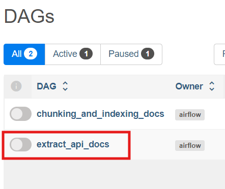
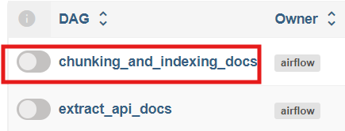
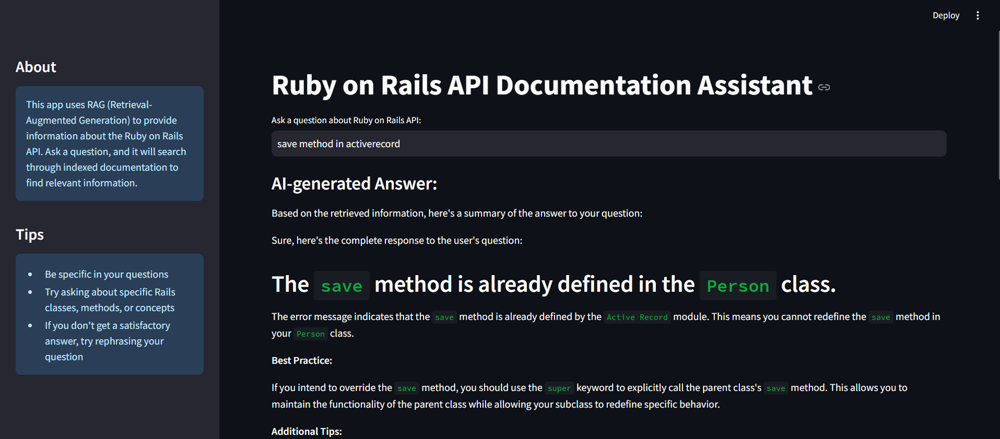

# Rails API documentation assitant RAG

## Project Overview

Rails API documentation assitant is a RAG application designed to assit Ruby on Rails developer with advance searching from the [rails api docs](https://api.rubyonrails.org/).
The main point of this app is to run the assitant locally by crawling the docs and use the Ollama model.

## Dataset

The dataset for this project is crawl from the [rails api docs](https://api.rubyonrails.org/). You can find the data in [data/bs4](data/bs4).

The data is just content from each page in the api that got extracted from html tags.

## Technologies

- Python 3.9
- Docker and Docker Compose for containerization
- Elasticsearch for vector search (vector store)
- Streamlit as Web UI
- Ollama as an LLM

## Running the application

```
docker compose up --build
```

For crawling the data, run the `extract_api_docs` DAG



Because the data is already crawled in [data/bs4](data/bs4), you can run the `chunking_and_indexing_docs` DAG right away



When the data is indexing successfully, you can goes to http://localhost:8501/ to open and experiment with the app.


